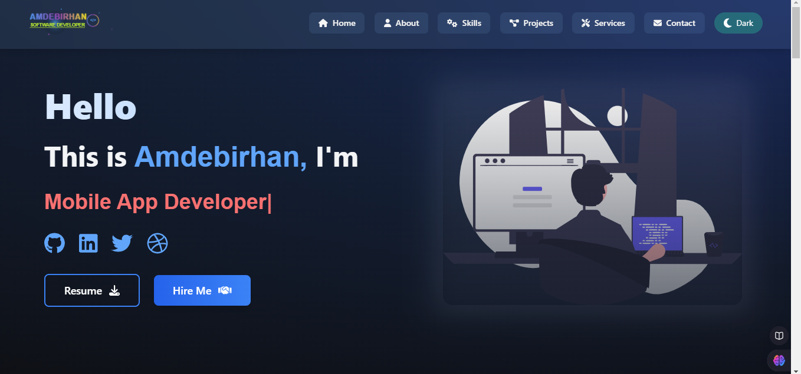
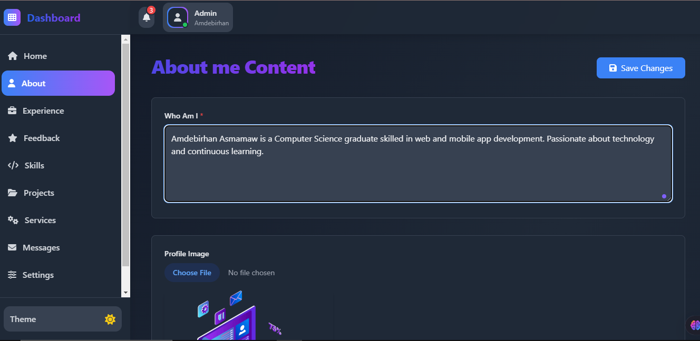

# Full-Stack Portfolio 🚀

Welcome to my full-stack portfolio project! This application showcases my skills as a full-stack developer, integrating modern frontend technologies with two independent backend services, both capable of handling the same functionality but built using different frameworks.

---

## **Overview** 🌟

### **Frontend**

- **Framework:** React
- **Animation Library:** Framer Motion 🎥
- **State Management & Data Fetching:** TanStack Query 🔄
- **Styling:** Tailwind CSS 🎨

### **Backend**

1. **Laravel with MySQL**

   - Deployed to handle user interactions and authentication.
   - Provides APIs for portfolio content management.
   - Clean and maintainable structure for reliability. 🛠️

2. **Express.js (Node.js) with PostgreSQL**
   - Deployed as an independent backend managing the same functionalities as Laravel.
   - Provides APIs for portfolio content management.
   - API-first design for flexibility. 🌐

### **Deployment**

- Both backends are standalone and interchangeable.
- The frontend integrates with the chosen backend dynamically.

---

## **Features** ✨

### **Frontend Features**

- Smooth animations powered by **Framer Motion**.
- Dynamic data fetching and caching using **TanStack Query**.
- Fully responsive design with **Tailwind CSS**.

### **Backend Features**

1. **Laravel Backend:**

   - Independent backend for authentication and portfolio management.
   - Reliable APIs for seamless frontend interaction.

2. **Express.js Backend:**
   - Standalone backend for portfolio data management and authentication.
   - Reliable APIs for seamless frontend interaction.
   - High performance with PostgreSQL scalability.

---

## **Technologies Used** 💻

### **Frontend**

- React ⚛️
- Framer Motion 🎞️
- TanStack Query 🗂️
- Tailwind CSS 🌈
- Axios 🌐

### **Backend**

1. **Laravel:**
   - Laravel 10.x 🟢
   - PHP 8+ 🐘
   - MySQL 🗄️
2. **Express.js:**
   - Node.js 🟢
   - PostgreSQL 🐘

### **Other Tools**

- Postman (for API testing) 📬
- Git and GitHub (version control) 🔗
- VS Code (code editor) 📝

---

## **Setup Instructions** 🛠️

### **Frontend**

1. Clone the repository:
   ```bash
   git clone <frontend-repo-url>
   ```
2. Install dependencies:
   ```bash
   npm install
   ```
3. Start the development server:
   ```bash
   npm start
   ```

### **Backend (Laravel)**

1. Clone the Laravel repository:
   ```bash
   git clone <laravel-repo-url>
   ```
2. Install dependencies:
   ```bash
   composer install
   ```
3. Configure `.env` file for MySQL database.
4. Run migrations:
   ```bash
   php artisan migrate
   ```
5. Start the Laravel server:
   ```bash
   php artisan serve
   ```

### **Backend (Express.js)**

1. Clone the Express.js repository:
   ```bash
   git clone <express-repo-url>
   ```
2. Install dependencies:
   ```bash
   npm install
   ```
3. Configure `.env` file for PostgreSQL database.
4. Start the Express.js server:
   ```bash
   npm start
   ```

---

## **API Endpoints** 🔗

### **Laravel Backend**

- **`/api/auth/login`** - User login.
- **`/api/content`** - Fetch portfolio content.

### **Express.js Backend**

- **`/api/auth/login`** - User login.
- **`/api/content`** - Fetch portfolio content.
- **`/api/projects`** - Manage projects.

---

## **Screenshots** 📸

## **Screenshots** 📸

### **Homepage**



### **Feature: Smooth Animations**



---

## **Future Improvements** 🚀

- Add real-time updates using WebSockets.
- Enhance accessibility for better UX.
- Add unit and integration tests for better reliability.

---

## **Contact** 📬

For any questions or feedback, feel free to reach out:

- **Email:** amdebrhanasmamaw93@gmail.com
- **LinkedIn:** [linkedin.com/in/amdebirhan-asmamaw](#)
- **GitHub:** [github.com/amde-asme-prog](#)

---

Thank you for visiting my portfolio! 🙏
